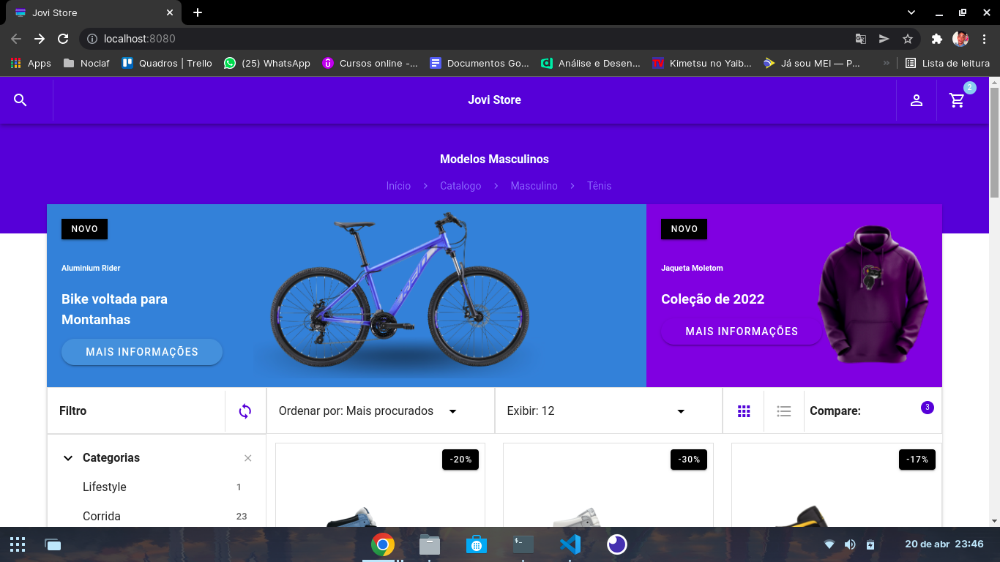

# Jovi Store 🛍️

A Jovi Store é um E-commerce idealizado por mim que utiliza Vue.js + Vuetify para trazer uma aplicação web simples e com design elegante.

<br>

# A aplicação está on-line no link: 

```
exemplo link
```

## Caso você queira analisar o projeto em sua maquina, siga este passo a passo: 😁

<br>

### Clone o repositório😎

```
git clone https://github.com/jovimoura/jovi-store
```

<br>

### Acesse o diretorio🤓

```
cd <nome-da-pasta>
```

<br>

### Instale as dependências🤠
```
npm install
```

<br>

### Inicie a aplicação🤩
```
npm run serve
```

<br>

### A aplicação, por padrão, fica na porta:🤗

```
http://localhost:8080/
```

<br>

## Imagem do projeto 💻



<br>

## Imagem do design responsivo 📱


<br>

## Tecnologias utilizadas🦉

<ul>
    <li>Vue.js</li>
    <li>Vuetify</li>
    <li>Java Script</li>
</ul>

<br>

## Autor😃

### João Victor dos Santos Moura
### E-mail: joaovictors.mouraa@gmail.com
### Linkedin: https://www.linkedin.com/in/jovimoura10/
